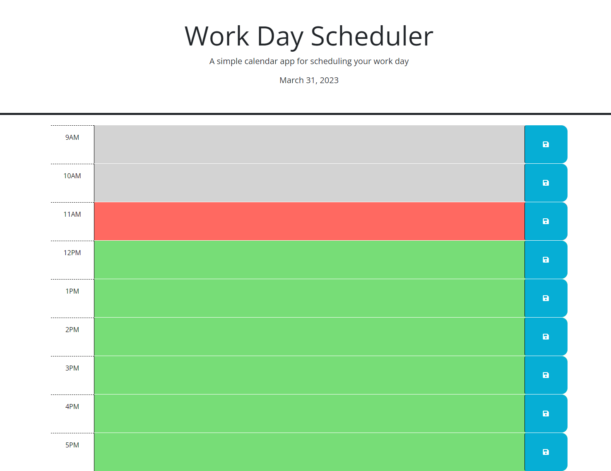

# ThirdParty-API-Day-Planner-C5

## Description
In this challenge, we were tasked to fill out the JavaScript for a weekday planner. Our task was to ensure that each timeblock was given the correct color, based on whether it is in the past, present, or future. If a time block is in the past, it is supposed to be gray, the present is supposed to be red, and the green represents future. In addition, we had to use local storage in order to save any text that was placed inside of each time block's text area. Then, when the page is refreshed, the saved text woulkd load into the correct time block. We also added the day's date at the top of the page.

The HTML starter code and css were given to us in the assignment.

## Table of Contents

N/A

## Installation

N/A

## Usage

Please follow the link below to the deployed website of my portfolio:

https://figgersrm.github.io/ThirdParty-API-Day-Planner-C5/

In order to clear the text that is currently saved, local storage must be cleared.

## Credits

N/A

## License

N/A

## Application Image

Below is an image of the deployed application:

